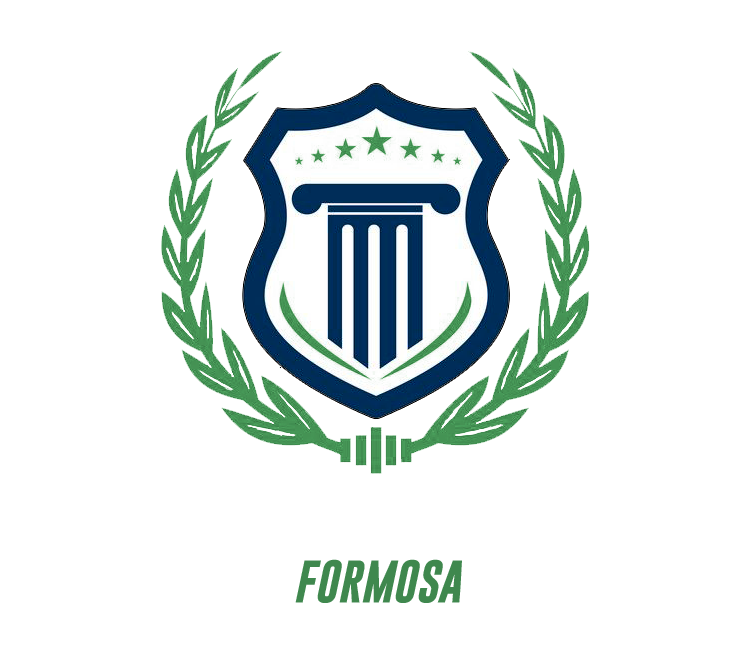

<h1 align="center">
   
  
   
</h1>

<b>BRITO ENZO EXEQUIEL</b>

## **📌Objetivo:**
### Una plataforma web para agilizar los procesos de: manejo de la gestión académica con respecto a las materias, notas (parciales, recuperatorios, finales), asistencias, información documental del alumno requerida por personal docente, avisos Generales. (Para todos los alumnos). Anuncios particulares (por clase).

#

### **🔰Tegnologias Utilizadas**
 
 

#
### Visualizar los modelos de la base de datos aqui: 
📋[ModeladosDB](https://github.com/EnzoEB12/TP-Instituto-Random/blob/master/ModeloDB.md "Enlace a los modelos db")

#

## **LOG DE DESARROLLO**
🔄En Proceso | | | |
✅Terminado
### **_Back End:_**

1. 30-9-22: Rutas de Alumnos. ✅
2. 30-9-22: Rutas de Publicaciones. ✅
3. 30-9-22: Controlador para los alumnos. ✅
4. 30-9-22: Modificación del modelo de la base de datos. [ publicaciones ]. ✅
5. 30-9-22: Conexión con la base de datos. ✅
6. 1-10-22: Se modifico el controlador para los alumnos✅
7. 1-10-22: Se Creo un controlador para las publicaciones, y se modifico el modelo de la BD.🔄
8. 1-10-22: Se comenzó a trabajar en las rutas GET y POST para las publicaciones.✅
9. 2-10-22: Se Creo Ruta para el login.✅
10. 2-10-22: Se Creo un helper para generar el token en el login.✅
11. 2-10-22: Se creo el middleware para validar el token enviado por los headers.✅
12. 2-10-22: Se Modifico el controlador de publicaciones para agregar un populate.✅
13. 2-10-22: Se Creo Rutas para las carreras.✅
14. 2-10-22: Se Creo Controlador para las carreras.✅
15. 2-10-22: Se Creo Ruta para los administradores.✅
16. 2-10-22: Se Creo Controlador para los administradores.🔄